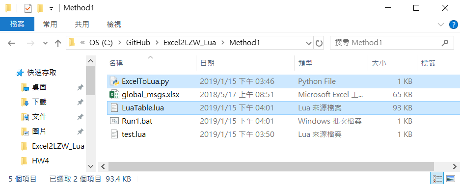
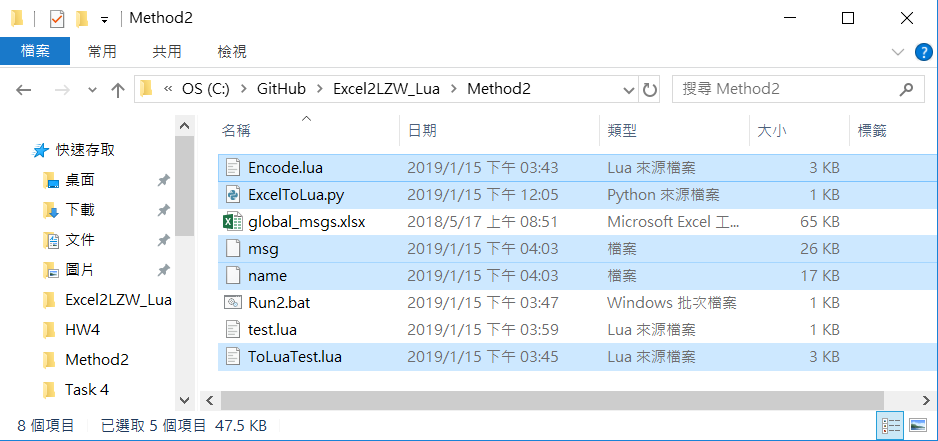

## 使用LZW壓縮將Excel檔案壓縮成一個節省記憶體的Lua Table封裝

實作要求：用你熟悉的語言寫一個工具。將下面的Excel【附件中提供】生成一個你認為最節省記憶體的方式lua檔。要求：這個lua檔返回一個Table，此Table可以用鍵值對的方式獲取資料。


**1. 方法一 用Python直接轉檔**

* 建立ExcelToLua.py: 將Excel檔(.xlsx)直接轉成Lua(.lua)檔，其內含一Table(pTable)

```python
# -*- coding: utf-8 -*-
import xlrd
import sys
import os
import re
import codecs

reload(sys)
sys.setdefaultencoding("utf-8")
myWorkbook = xlrd.open_workbook('global_msgs.xlsx') # load file

mySheets = myWorkbook.sheets()
mySheet = mySheets[0]
nrows = mySheet.nrows
ncols = mySheet.ncols

fo = open ("ToLuaTest.lua","w")
fo.write ("pTable={\n")
for i in range(6,nrows):
    fo.write ("\t{") 
    name_str = str(mySheet.cell(i,0).value).replace("\n","\\n") # replace \n to \\n
    msg_str = str(mySheet.cell(i,1).value).replace("\n","\\n") # replace \n to \\n
    fo.write ("name=\"" + name_str + "\",msg=\"" + msg_str + "\"},\n")
fo.write ("}")
fo.close
```

* 建立test.lua檔案測試抓取pTable

```lua
local key = 100; 
require("ToLuaTest");
local row = pTable[key];
print(row.name,row.msg);
```

* 執行

```bash
python ExcelToLua.py
lua test.lua
```

* 記憶體使用量分析

使用記憶體量為93.4KB，遠大於原先的Excel檔案(64KB)。

 


**2. 方法二：加入使用LZW壓縮演算法壓縮建立壓縮檔，呼叫時先解碼再回傳pTable**

* 先將原來ExcelToLua.py中的輸出名改為LuaTable.lua
``` python
fo = open ("LuaTable.lua","w")
```

* 建立Encode.lua，將LuaTable.lua壓縮成name與msg兩個檔案

```lua
local char = string.char
local sub = string.sub
local tconcat = table.concat

local basedictcompress = {}
local A = {}
local input

local function initDict()
	basedictcompress = {}
	A = {}
	for i = 0, 255 do
    	local ic, iic = char(i), char(i, 0)
	    basedictcompress[ic] = iic
	end
	return
end
local function dictAddA(str, dict, a, b)
    if a >= 256 then
        a, b = 0, b+1
        if b >= 256 then
            dict = {}
            b = 1
        end
    end
    dict[str] = char(a,b)
    a = a+1
    return dict, a, b
end
local function compress(input)
    if type(input) ~= "string" then
        return nil, "string expected, got "..type(input)
    end
    local len = #input
    if len <= 1 then
        return "u"..input
    end

    local dict = {}
    local a, b = 0, 1

    local result = {"c"}
    local resultlen = 1
    local n = 2
    local word = ""
    for i = 1, len do
        local c = sub(input, i, i)
        local wc = word..c
        if not (basedictcompress[wc] or dict[wc]) then
            local write = basedictcompress[word] or dict[word]
            if not write then
                return nil, "algorithm error, could not fetch word"
            end
            result[n] = write
            resultlen = resultlen + #write
            n = n+1
            if  len <= resultlen then
                return "u"..input
            end
            dict, a, b = dictAddA(wc, dict, a, b)
            word = c
        else
            word = wc
        end
    end
    result[n] = basedictcompress[word] or dict[word]
    resultlen = resultlen+#result[n]
    n = n+1
    if  len <= resultlen then
        return "u"..input
    end
    return tconcat(result)
end
local function Output(str)
	input = table.concat(A, char(17))
	local compressed = compress(input)
	local out = assert(io.open(str, "wb"))
	out:write(compressed)
	assert(out:close())
end

require("LuaTable")
-- name compress --
initDict()
for k, v in ipairs(pTable) do
	A[k] = pTable[k].name
end
Output("name")

-- msg compress --
initDict()
for k, v in ipairs(pTable) do
	A[k] = pTable[k].msg
end
Output("msg")
```

* 建立新的ToLuaTest.lua：內含對name與msg的呼叫、對其解壓縮、匯入成一個pTable表格

```lua
local char = string.char
local sub = string.sub
local tconcat = table.concat

local basedictdecompress = {}
for i = 0, 255 do
   	local ic, iic = char(i), char(i, 0)
    basedictdecompress[iic] = ic
end
local function dictAddB(str, dict, a, b)
    if a >= 256 then
        a, b = 0, b+1
        if b >= 256 then
            dict = {}
            b = 1
        end
    end
    dict[char(a,b)] = str
    a = a+1
    return dict, a, b
end
local function decompress(input)
    if type(input) ~= "string" then
        return nil, "string expected, got "..type(input)
    end

    if #input < 1 then
        return nil, "invalid input - not a compressed string"
    end

    local control = sub(input, 1, 1)
    if control == "u" then
        return sub(input, 2)
    elseif control ~= "c" then
        return nil, "invalid input - not a compressed string"
    end
    input = sub(input, 2)
    local len = #input

    if len < 2 then
        return nil, "invalid input - not a compressed string"
    end

    local dict = {}
    local a, b = 0, 1

    local result = {}
    local n = 1
    local last = sub(input, 1, 2)
    result[n] = basedictdecompress[last] or dict[last]
    n = n+1
    for i = 3, len, 2 do
        local code = sub(input, i, i+1)
        local lastStr = basedictdecompress[last] or dict[last]
        if not lastStr then
            return nil, "could not find last from dict. Invalid input?"
        end
        local toAdd = basedictdecompress[code] or dict[code]
        if toAdd then
            result[n] = toAdd
            n = n+1
            dict, a, b = dictAddB(lastStr..sub(toAdd, 1, 1), dict, a, b)
        else
            local tmp = lastStr..sub(lastStr, 1, 1)
            result[n] = tmp
            n = n+1
            dict, a, b = dictAddB(tmp, dict, a, b)
        end
        last = code
    end
    return tconcat(result)
end
local function getTableString(str)
	local red = assert(io.open(str, "rb"))
	local reds = red:read("*all")	
	assert(red:close())
	return decompress(reds)
end

local Name = getTableString("name")
local Msg = getTableString("msg")
pTable = {}

local ns, ne, i = 1, 1, 1
for i = 1,#Name do
	ne = string.find(Name,char(17),ns)
	if ne == nil then
		pTable[i] = {name=sub(Name,ns, #Name), msg = ""}
		break
	else
		pTable[i] = {name=sub(Name,ns, ne - 1), msg = ""}
		ns = ne + 1
	end	
end

local ns, ns = 1, 1
for i = 1,#Msg do
	ne = string.find(Msg,char(17),ns)
	if ne == nil then
		pTable[i].msg = sub(Msg,ns,#Msg)
		break
	else
		pTable[i].msg = sub(Msg,ns, ne - 1)
		ns = ne + 1
	end	
end
```

* 執行
壓縮(加碼)後，LuaTable.lua已不需要，故於加密後刪除

```bash
python ExcelToLua.py
lua Encode.lua
del LuaTable.lua
lua test.lua
```

* 記憶體使用量分析

使用記憶體量為47.5KB，相較於原先的Excel檔案(64KB)，壓縮率約為74.22%。相較於方法一的LuaTable.lua檔，僅約占一半的記憶體空間。

 

